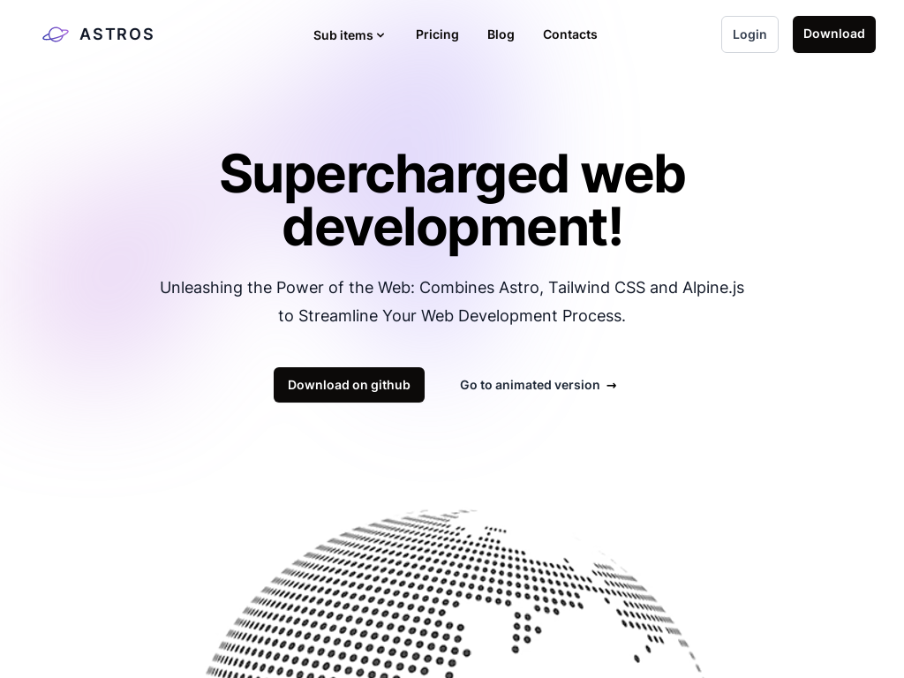
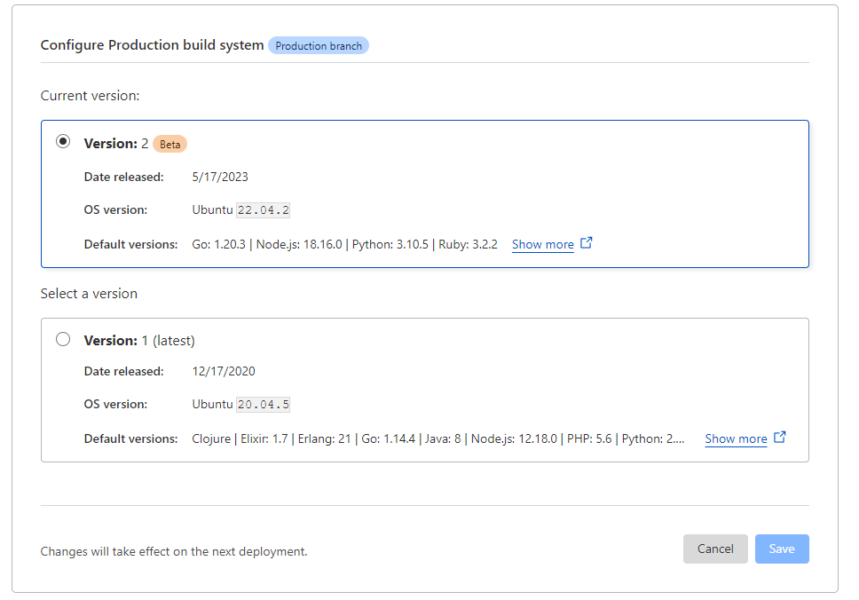

<a href="https://astros.zank.studio">
  
</a>

# [Astros](https://astros.zank.studio)

<a href="https://astro.build/"></a>
<a href="https://tailwindcss.com/"></a>
<a href="https://alpinejs.dev/"></a>

Astros is a template made with [Astro](https://astro.build), [Tailwind](https://tailwindcss.com/) and [AlpineJS](https://alpinejs.dev/).

This project is strongly inspired by [Astroship](https://github.com/surjithctly/astroship), [Flowbite](https://flowbite.com/blocks/) and [Tailwind UI](https://tailwindui.com/components) components, make sure to check them out as well!


[](https://deploy.workers.cloudflare.com/?url=https://github.com/zankhq/astros)

[](https://app.netlify.com/start/deploy?repository=https://github.com/zankhq/astros)

[](https://vercel.com/new/clone?repository-url=https://github.com/zankhq/astros)


### [🧪 Site preview →](https://astros.zank.studio)

### [🧑‍🚀 Astro website →](https://astro.build/)

### [🕮 Astro docs →](https://docs.astro.build/en/getting-started/)

---

## Preview




## 🧪 Test

On the folder run

1. `npm i`  <small>(or `yarn` or `pnpm i`)</small>
2. `npm run dev`  <small>(or `yarn dev` or `pnpm dev`)</small>

(if it's not working report an [issue](https://github.com/zankhq/astros/issues))

## 🚀 Deploy

### Cloudflare pages (suggested)

You can either click on the button above to deploy to Cloudflare automatically, or you can fork this repository and deploy manually from cloudflare dashboard.

You can leave build settings as defaults.

<details>
<summary>Cloudflare configuration</summary>



</details>

### Netlify

`TODO`

### Vercel

`TODO`

### Others

You can check the deploy documentation at https://docs.astro.build/en/guides/deploy/

## ✅ Features

- [x] Localization (with astro-i18next)
- [x] Light/Dark mode (provided by tailwind)
- [x] Discussion on articles (thanks to giscus)
- [x] Blog
- [x] CMS for editing blog post (thanks to Sveltia CMS)
- [x] PWA (thanks to vite-pwa)
- [ ] AI to generate article posts

## ✍️ Admin dashboard

You can access the admin dashboard for editing blog post at `/admin` (https://astros.zank.studio/admin)

For more information follow Sveltia CMS documentation at [https://github.com/sveltia/sveltia-cms](https://github.com/sveltia/sveltia-cms)

## 🧞 Dependencies

Astros depends on the following packages:

| Dependency                                                                             | Version        |
| -------------------------------------------------------------------------------------- | -------------- |
| [@astrojs/mdx](https://www.npmjs.com/package/@astrojs/mdx)                             | ^0.19.7        |
| [@astrojs/rss](https://www.npmjs.com/package/@astrojs/rss)                             | ^2.4.3         |
| [@astrojs/sitemap](https://www.npmjs.com/package/@astrojs/sitemap)                     | ^1.3.3         |
| [@astrojs/tailwind](https://www.npmjs.com/package/@astrojs/tailwind)                   | ^3.1.3         |
| [@fontsource-variable/inter](https://www.npmjs.com/package/@fontsource-variable/inter) | ^5.0.2         |
| [astro](https://www.npmjs.com/package/astro)                                           | ^2.6.1         |
| [astro-i18next](https://www.npmjs.com/package/astro-i18next)                           | ^1.0.0-beta.21 |
| [astro-icon](https://www.npmjs.com/package/astro-icon)                                 | ^0.8.1         |
| [astro-seo](https://www.npmjs.com/package/astro-seo)                                   | ^0.7.4         |
| [bad-words](https://www.npmjs.com/package/bad-words)                                   | ^3.0.4         |
| [dotenv](https://www.npmjs.com/package/dotenv)                                         | ^16.1.4        |
| [openai](https://www.npmjs.com/package/openai)                                         | ^3.2.1         |
| [rehype-autolink-headings](https://www.npmjs.com/package/rehype-autolink-headings)     | ^6.1.1         |
| [rehype-slug](https://www.npmjs.com/package/rehype-slug)                               | ^5.1.0         |
| [rss-parser](https://www.npmjs.com/package/rss-parser)                                 | ^3.13.0        |
| [tailwindcss](https://www.npmjs.com/package/tailwindcss)                               | ^3.3.2         |

## Known issues

- Localization is not detected automatically


  {
    title: "Why alpinejs? Why don't just use js?",
    description: "Alpine js is less than 17kb and it make javascript very fast to write, there are also various open source ready to use components like https://js.hyperui.dev, https://www.alpinetoolbox.com/examples, https://alpinejs.dev/components#components",
  },
  {
    title: "But I don't need alpine js, can I remove it?",
    description: `Of course, but some components use it and you'll have to edit these, more specifically you ll have to: <br/>
          <ul style="list-style: inside;">
            <li>First remove the package with the command <code>npm unistall @astrojs/alpinejs @types/alpinejs alpinejs</code></li>
            <li>Adjust all components that uses alpine js: <code>faq.astro</code>, <code>themeselector.astro</code>, <code>navbar.astro</code></li>
          </ul>`,
  },
  {
    title: "How can I configure the decap CMS authentication with netlify?",
    description: `To configure decap CMS with netlify do the followings:
          <ul style="list-style: inside;">
            <li>Change NetlifyCMS config <code>config.backend.name</code> to git-gateway</li>
            <li>Use integrated NetlifyCMS auth <a href="https://decapcms.org/docs/git-gateway-backend/#git-gateway-with-netlify" target="_blank">https://decapcms.org/docs/git-gateway-backend/#git-gateway-with-netlify</a></li>
          </ul>`,
  }

  
        <a class="duration-300 hover:text-gray-900 dark:hover:text-gray-100" href="#" title="twitter" target="blank" aria-label="twitter">
        <svg xmlns="http://www.w3.org/2000/svg" fill="currentColor" class="m-auto h-5 w-5" viewBox="0 0 16 16">
          <path
            d="M5.026 15c6.038 0 9.341-5.003 9.341-9.334 0-.14 0-.282-.006-.422A6.685 6.685 0 0 0 16 3.542a6.658 6.658 0 0 1-1.889.518 3.301 3.301 0 0 0 1.447-1.817 6.533 6.533 0 0 1-2.087.793A3.286 3.286 0 0 0 7.875 6.03a9.325 9.325 0 0 1-6.767-3.429 3.289 3.289 0 0 0 1.018 4.382A3.323 3.323 0 0 1 .64 6.575v.045a3.288 3.288 0 0 0 2.632 3.218 3.203 3.203 0 0 1-.865.115 3.23 3.23 0 0 1-.614-.057 3.283 3.283 0 0 0 3.067 2.277A6.588 6.588 0 0 1 .78 13.58a6.32 6.32 0 0 1-.78-.045A9.344 9.344 0 0 0 5.026 15z">
          </path>
        </svg>
      </a>
      <a class="duration-300 hover:text-gray-900 dark:hover:text-gray-100" href="#" title="linkedin" target="blank" aria-label="linkedin">
        <svg xmlns="http://www.w3.org/2000/svg" fill="currentColor" class="m-auto w-5" viewBox="0 0 16 16">
          <path
            d="M0 1.146C0 .513.526 0 1.175 0h13.65C15.474 0 16 .513 16 1.146v13.708c0 .633-.526 1.146-1.175 1.146H1.175C.526 16 0 15.487 0 14.854V1.146zm4.943 12.248V6.169H2.542v7.225h2.401zm-1.2-8.212c.837 0 1.358-.554 1.358-1.248-.015-.709-.520-1.248-1.342-1.248-.822 0-1.359.54-1.359 1.248 0 .694.521 1.248 1.327 1.248h.016zm4.908 8.212V9.359c0-.216.016-.432.08-.586.173-.431.568-.878 1.232-.878.869 0 1.216.662 1.216 1.634v3.865h2.401V9.25c0-2.22-1.184-3.252-2.764-3.252-1.274 0-1.845.7-2.165 1.193v.025h-.016a5.54 5.54 0 0 1 .016-.025V6.169h-2.4c.03.678 0 7.225 0 7.225h2.4z">
          </path>
        </svg>
      </a>


Mục tiêu của Yoga: đạt tới hạnh phúc hoàn hảo

Yoga là chiếc chìa khóa vàng để mở tung cánh cửa dẫn đến sự bình an, tĩnh lặng, niềm vui sướng và hạnh phúc.

Asana (các tư thế):

Những bài tập đặc biệt có tác động lên các tuyến nội tiết, các khớp, cơ bắp, dây chằng và dây thần kinh, giúp ổn định nhịp thở và huyết áp, nhằm phát triển toàn diện cơ thể và tâm trí của người tập.

Quá trình thực hành thiền định:

Giúp làm dịu hệ thống thần kinh trung ương cũng như nhịp tim, huyết áp và giảm stress. Đồng thời, gia tăng trí lực, trực giác nhạy bén, tăng sự độ lượng và tính cởi mở.


YOGA ANANDA MARGA
Ngày nay, con người lao vào cuộc sống tất bật, khó làm chủ được các cảm xúc nên dễ rơi vào các trạng thái bất an (lo lắng, căng thẳng, sợ sệt, giận dỗi,…). Lâu dần các cảm xúc bị dồn nén, không được giải tỏa dễ dẫn đến các căn bệnh mất ngủ, trầm cảm, stress và nặng hơn là bị những bệnh như loét dạ dày, rối loạn tim mạch, ung thư,…
Enlightenment in nature

Nguyên nhân chính: do họ chỉ giải quyết căn bệnh dựa trên nền tảng vật chất mà không biết rằng phần lớn bệnh tật là do tinh thần hay tâm trí mà ra. Vì thế, chúng ta cần thiền định thường xuyên.

Thiền định: là phương pháp khoa học giúp cho con người cân bằng được tâm trí và thân thể thông qua việc tĩnh lặng cơ thể theo hơi thở, hướng đến sự bình an và hạnh phúc ẩn sâu bên trong. Việc này chuyển hóa các cảm xúc từ trạng thái tiêu cực sang thái độ tích cực (biểu hiện thông qua tình yêu thương, lòng vị tha,…) Đây chính là cơ sở vững chắc, giúp giải quyết mọi vấn đề thời đại, mở ra con đường thú vị là “Tự khám phá bản thân” và “hoàn thiện bản thân mình” ngày càng tốt đẹp hơn.


Địa chỉ:
Số 34 Phan Liêm, Phường Đa Kao, Quận 1, Tp. Hồ Chí Minh
yogahoasen.vn@gmail.com
091 887 3316
Thời gian làm việc:
Thứ 2 – Thứ 5: 06:00 – 21:00
Thứ 7 & CN: 09:00 – 18:00
Lưu ý: Thứ 6 nghỉ


## FAQ

<br/>

<details>
  <summary>What is this?</summary>
<br/>
  This is a astro template that uses tailwindcss and alpinejs
</details>
<br/>

<details>
  <summary>Why alpinejs? Why don't just use js?</summary>
<br/>
  Alpine js is less than 17kb and it make javascript very fast to write, there are also various open source ready to use components like https://js.hyperui.dev, https://devdojo.com/pines, https://www.alpinetoolbox.com/examples, https://alpinejs.dev/components#components
</details>
<br/>

<details>
  <summary>But I don't need alpine js, can I remove it?</summary>
<br/>
  Of course, but some components use it and you'll have to edit these, more specifically you ll have to: <br/>
  <ul style="list-style: inside;">
    <li>First remove the package with the command <code>npm unistall @astrojs/alpinejs @types/alpinejs alpinejs</code></li>
    <li>Adjust all components that uses alpine js: <code>faq.astro</code>, <code>themeselector.astro</code>, <code>navbar.astro</code></li>
  </ul>
</details>
<br/>

<details>
  <summary>Can I remove also tailwidcss?</summary>
<br/>
  I mean, you can, but you'll have to basically rewrite all the template, so I don't recommend it
</details>
<br/>

<details>
  <summary>I don't need client routing, how can I remove it?</summary>
<br/>
  From astro 2.9 you can opt-in for client routing (https://astro.build/blog/astro-290) by activating the experimental flag viewTransitions <br/>
  You can remove client routing by removing <code>viewTransitions: true</code> from <code>astro.config.mjs</code> And the <code>ViewTransitions</code> component from Layout.astro
</details>
<br/>

<details>
  <summary>I don't need multiple language, how can I remove it?</summary>
<br/>
  One way is to simply keep one language and remove the selector from the footer but in order to fully remove the localization you have to: <br/>
  <ul style="list-style: inside;">
    <li>Remove the i18next pacakage <code>npm unistall astro-i18next</code></li>
    <li>Remove <code>astro-i18next.config.mjs</code> file</li>
    <li>Remove <code>locales</code> folder from public</li>
    <li>Remove <code>languageselector.astro</code> file and from footer</li>
    <li>Find all reference to <code>i18next</code> and <code>astro-i18next</code> and replace with your text</li>
  </ul>
</details>
<br/>

<details>
  <summary>I don't need dark mode, how can I remove it?</summary>
<br/>
  Dark mode is embedded into tailwindcss, so you can't remove it, but you can remove the switch from the navbar
</details>
<br/>


<details>
  <summary>How can I configure the Sveltia CMS authentication with cloudflare?</summary>
<br/>
  To configure Sveltia CMS with cloudflare follow this guide <a href="https://github.com/sveltia/sveltia-cms" target="_blank">https://github.com/sveltia/sveltia-cms</a>
</details>
<br/>


<details>
  <summary>How can I change the localization languages?</summary>
<br/>
  In order to change the languages you have to change the languages in the file <code>astro-i18next.config.mjs</code> and in the netlifyCMS configuration on the file <code>astro.config.mjs</code> <br/>
  Then change the locales files folders in <code>public/locales</code>
</details>
<br/>

<details>
  <summary>What are the files in the function folder used for?</summary>
<br/>
  These are cloudflare function that are used for the authentication to the decap CMS
</details>
<br/>

<details>
  <summary>The build on cloudflare keep failing, why?</summary>
<br/>
  One of the problem could be that the Build system version is setted to version 1, make sure that version 2 is selected
</details>
<br/>

<details>
  <summary>Work with modules in relink</summary>
<br/>
  This is helpful if you want to apply some changes to various modules while you are working on the website.
To do so you have to go into each module and run

```
npm link
```
</details>
<br/>

---

<p align="right"><a href="https://zank.studio/" target="_blank">zank.studio</p>
